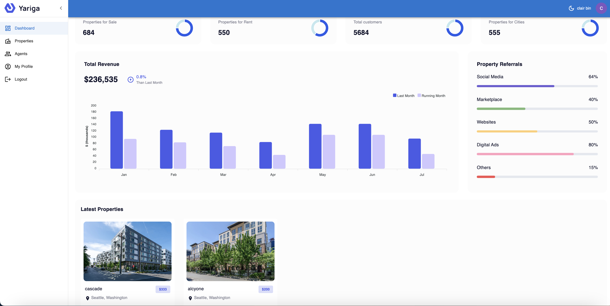

# A Full Stack Dashboard App With Next.js,CRUD, Auth, and Charts Using Refine
https://nextjs-demo-claire.vercel.app


## <a name="tech-stack">⚙️ Tech Stack</a>

- Next.js
- MongoDB
- NextAuth with Google Oauth
- Material UI
- TypeScript
- Refine
- Cloudinary
- React Apexcharts

## <a name="features">🔋 Features</a>

👉 **Modern Design with Glassmorphism Trend Style**: A modern and visually appealing design, incorporating the glassmorphism trend style for a sleek and contemporary appearance.

👉 **Home Page**: Showcases charts for key metrics and latest properites.

👉 **Properties Page**: Allow users to search for properties based on property types, title and sort by price combined with pagination.

👉 **Edit and Delete Created Properties**: Users have the ability to edit their created properties at any time and delete them when needed.

👉 **Profile Page**: Each user gets a dedicated profile page showcasing all the properties they've created, providing an overview of their listings.

👉 **View Other Agent's Profiles**: Users can explore the profiles of other agents to view the properties they've listed

👉 **Google Authentication using NextAuth**: Enable secure Google authentication using NextAuth, ensuring a streamlined and trustworthy login experience.

👉 **Responsive Website**: Develop a fully responsive website to ensure optimal user experience across various devices, from desktops to smartphones

👉 **image management**: optimize images and store them on the cloud using Cloudinary 

## <a name="quick-start">🤸 Quick Start</a>

Follow these steps to set up the project locally on your machine.

**Prerequisites**

Make sure you have the following installed on your machine:

- [Git](https://git-scm.com/)
- [Node.js](https://nodejs.org/en)
- [npm](https://www.npmjs.com/) (Node Package Manager)

**Cloning the Repository**

```bash
git clone https://github.com/binhuiyun/next_dashboard.git
cd next_dashboard
```

**Installation**

Install the project dependencies using npm:

```bash
npm install
```

**Set Up Environment Variables**

Create a new file named `.env` in the root of your project and add the following content:

```env
NEXTAUTH_SECRET=
GOOGLE_ID=
GOOGLE_CLIENT_SECRET=
MONGODB_URI=
CLOUDINARY_CLOUD_NAME = 
CLOUDINARY_API_KEY = 
CLOUDINARY_API_SECRET =
```

Replace the placeholder values with your actual credentials. You can obtain these credentials by signing up on these corresponding websites from [Google Cloud Console](https://console.cloud.google.com/welcome?rapt=AEjHL4MBaLLneW6OfAHf_zgms1eWZFw1wdy0_KIC4uh1nEqh2m4ojOvrXNlzJ4h7CZTkpiWgcsoHbUvS-FMdCP7WIkaVlPAeU7cnVR6Y0wJHeLMOtU6KAzA&project=promptopia-385410), [Cryptpool](https://www.cryptool.org/en/cto/openssl) (for random Auth Secret), and [MongoDB](https://www.mongodb.com/). 

**Running the Project**

```bash
npm run dev
```

Open [http://localhost:3000](http://localhost:3000) in your browser to view the project.


